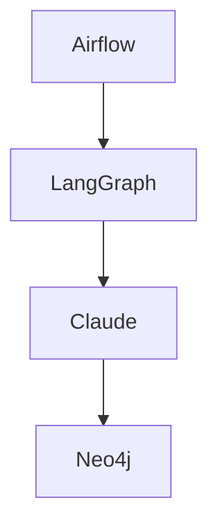

# Visual Documentation Guide for README

**Goal:** Add 5-8 images showcasing actual platform work, not just marketing charts

---

## 📸 Images to Add to README

### 1. System Architecture Diagram (PRIORITY 1)
**File:** `assets/images/system-architecture.png`

**What to Show:**
```
30 Containers Operational:
┌─────────────────────────────────────────┐
│  ORCHESTRATION LAYER                    │
│  - Airflow (10 DAGs)                    │
│  - Native LangGraph Service             │
└─────────────────────────────────────────┘
            ↓
┌─────────────────────────────────────────┐
│  AI/ML LAYER                            │
│  - Claude Sonnet 4                      │
│  - DSPy (6 signatures)                  │
│  - Graph ML (775K edges)                │
└─────────────────────────────────────────┘
            ↓
┌─────────────────────────────────────────┐
│  MULTI-DATABASE LAYER                   │
│  - PostgreSQL │ Neo4j │ Redis │ Chroma  │
└─────────────────────────────────────────┘
            ↓
┌─────────────────────────────────────────┐
│  MONITORING LAYER                       │
│  - Prometheus │ Grafana │ Exporters     │
└─────────────────────────────────────────┘
```

**How to Generate:**
- Use draw.io or Excalidraw
- Show actual container names
- Include data flows
- Highlight operational components (green)

### 2. Airflow DAGs Screenshot (PRIORITY 1)
**File:** `assets/images/airflow-dags-ui.png`

**What to Capture:**
- Screenshot from http://localhost:8080
- Show 10 DAGs listed
- Include status indicators (running, paused)
- Highlight successful runs (green circles)
- Show real schedules (every 1 min, 5 min, daily)

**Why Important:**
Shows actual production workflows, not theory

### 3. Neo4j Graph Visualization (PRIORITY 1)
**File:** `assets/images/neo4j-knowledge-graph.png`

**What to Capture:**
From Neo4j Browser (http://localhost:7474):
```cypher
// Query to visualize:
MATCH (c:Company)-[r]-(related)
RETURN c, r, related
LIMIT 50
```

**Show:**
- Company nodes (with names)
- Relationship types (COMPETES_WITH, BELONGS_TO, CORRELATED_WITH)
- Network structure
- 775K relationships metric

**Why Important:**
Demonstrates graph ML capabilities visually

### 4. Prometheus Metrics Dashboard (PRIORITY 2)
**File:** `assets/images/prometheus-metrics.png`

**What to Capture:**
From http://localhost:9090:
- Targets page showing 13 scrape targets
- Graph showing `claude_api_calls_total` over time
- Graph showing `pipeline_runs_total` by status
- System health metrics

**Why Important:**
Shows production monitoring in action

### 5. Data Quality Dashboard (PRIORITY 2)
**File:** `assets/images/data-quality-monitoring.png`

**What to Create:**
Graph showing:
- Quality scores over 7 days (should be 95-100)
- Anomaly detection counts (low = good)
- Validation pass rates (100%)
- Data freshness metrics

**Data Source:** PostgreSQL data_quality_metrics table

**Why Important:**
Demonstrates automated quality framework

### 6. LangGraph Workflow Diagram (PRIORITY 2)
**File:** `assets/images/langgraph-workflow.png`

**What to Show:**
```
M&A Analysis Workflow (Actual Implementation):

[Company Query] → [Research Agent] 
                     ↓
              [Financial Agent]
                     ↓
              [Strategic Agent]
                     ↓
                 [Risk Agent]
                     ↓
             [Valuation Agent]
                     ↓
          [Recommendation Agent]
                     ↓
              [Store in Neo4j]
```

**Include:**
- Real agent names from code
- Data flows (Neo4j queries, Claude calls)
- State management

**Why Important:**
Shows LangGraph multi-agent design

### 7. Claude API Cost Tracking (PRIORITY 3)
**File:** `assets/images/claude-cost-optimization.png`

**What to Show:**
Chart displaying:
- Daily Claude API costs
- Cache hit rate (70-90%)
- Cost savings from caching
- Per-DAG cost breakdown

**Data Source:** PostgreSQL claude_usage_tracking table

**Why Important:**
Demonstrates production cost optimization

### 8. Container Health Dashboard (PRIORITY 3)
**File:** `assets/images/container-health.png`

**What to Show:**
```
docker ps output formatted as table:
- 30 containers listed
- All showing "healthy" or "Up X hours"
- Group by category:
  * Databases (4)
  * Airflow (2)
  * LangGraph (5)
  * MCP Servers (12)
  * Monitoring (6)
  * Native LangGraph (1)
```

**Why Important:**
Shows actual deployed system

---

## 🎨 How to Generate These Images

### For Screenshots (Airflow, Neo4j, Prometheus)
1. Access the live UI
2. Take full-window screenshot
3. Crop to relevant area
4. Optimize size (max 500 KB)
5. Save to `assets/images/`

### For Diagrams (Architecture, Workflows)
**Option A: Excalidraw (Recommended)**
```bash
# Online tool
https://excalidraw.com

# Features:
- Hand-drawn style (professional but approachable)
- Easy boxes and arrows
- Export as PNG
- Free, no account needed
```

**Option B: Draw.io**
```bash
# Online or desktop
https://app.diagrams.net

# Features:
- Professional diagrams
- Many templates
- Export as PNG/SVG
```

**Option C: Mermaid (Code-based)**
```markdown
# In markdown file:


# Render with GitHub or mermaid.live
```

### For Charts (Quality, Costs)
**Use Python + Matplotlib:**
```python
import matplotlib.pyplot as plt
import psycopg2

# Query data
conn = psycopg2.connect(...)
cur = conn.cursor()
cur.execute("SELECT metric_date, quality_score FROM data_quality_metrics ORDER BY metric_date")

dates, scores = zip(*cur.fetchall())

# Create chart
plt.figure(figsize=(10, 6))
plt.plot(dates, scores, marker='o')
plt.title('Data Quality Scores - 7 Day Trend')
plt.ylabel('Quality Score (0-100)')
plt.xlabel('Date')
plt.grid(True, alpha=0.3)
plt.savefig('assets/images/data-quality-trend.png', dpi=150, bbox_inches='tight')
```

---

## 📋 Image Addition Checklist

### Quick Wins (Screenshots - 30 minutes)
- [ ] Airflow UI (http://localhost:8080)
- [ ] Neo4j Browser (http://localhost:7474)
- [ ] Prometheus targets (http://localhost:9090/targets)
- [ ] Docker ps output formatted

### Medium Effort (Diagrams - 1-2 hours)
- [ ] System architecture (draw.io or excalidraw)
- [ ] LangGraph workflow (mermaid or excalidraw)
- [ ] Data pipeline flow

### Advanced (Generated Charts - 2-3 hours)
- [ ] Data quality trends (Python + matplotlib)
- [ ] Claude cost tracking (Python + matplotlib)
- [ ] Container health over time

---

## 🎯 Recommended Image Order in README

```markdown
# At the top (hero image):

*30-container production system*

# In "Live Platform" section:

*10 operational data pipelines*


*775K relationship network*

# In "AI/ML Showcase" section:

*Multi-agent M&A analysis*

# In "Performance" section:

*Real platform output: Portfolio optimization, VaR, correlations*

# In "Monitoring" section:

*Production observability*


*Automated quality tracking*

# In "Operations" section:

*30/30 containers healthy*
```

---

## 🚀 Immediate Action Items

**For This Session:**
1. Take screenshot of Airflow UI (2 minutes)
2. Take screenshot of Neo4j graph (2 minutes)
3. Add both to README (5 minutes)
4. Commit and push

**For Next Session:**
1. Create system architecture diagram (30 minutes)
2. Generate data quality chart from PostgreSQL (20 minutes)
3. Create LangGraph workflow diagram (20 minutes)
4. Update README with all images

**Result:** Professional visual documentation showing actual working platform.

---

## 💡 Pro Tips

### Image Optimization
```bash
# Reduce size without losing quality
convert large.png -resize 50% -quality 85 optimized.png

# Or use online: tinypng.com
```

### Image Hosting
- ✅ Store in repo: `assets/images/` (current approach)
- ✅ Relative paths in markdown: ``
- ❌ Don't use external hosting (links break)

### Accessibility
```markdown
# Always include alt text:

*Caption: Production data workflows running 31+ hours*
```

---

**Next Step:** Take 2-3 quick screenshots (Airflow UI, Neo4j graph, Docker ps) and add to README. Demonstrates real platform visually.